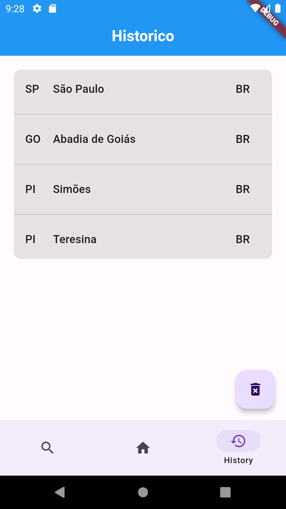

# Challenge Accepted Mobile

    O desafio seria criar uma aplicação onde o usuario pudesse ver a previsão dos proximos dias, utilizando a api API Advisor da Climatempo.

    Inicialmente seria desenvolvido em react-native, mas foi permitido que fosse desenvolvido usando Flutter/Dart.

### Requisitos

- [ ] A aplicação deve ser construida em react-native, utilizando o React Native CLI (`react-native init`);
- [x] O usuário pode consultar novas cidades através de um campo de busca;
- [x] O aplicativo deve armazenar um histórico com os nomes das cidades pesquisadas;
- [x] O aplicativo deve fornecer uma maneira de ver o histórico de cidades pesquisadas;
- [x] O aplicativo deve permitir uma forma de limpar o histórico de pesquisas;
- [x] Testes unitários devem ser aplicados;
- [ ] Testes e2e podem ser aplicados; (Opcional)
- [x] O aplicativo deve possuir uma abordagem **offline first**, após a primeira consulta caso a conexão com a internet esteja indiponível o app deve exibir
  a última consulta bem sucedida;

- [x] Cada dia da previsão deve ser exibido em um card com os seguintes campos:
    * Dia e mês da previsão;
    * Temperatura mínima;
    * Temperatura máxima;
    * Velocidade do vento;
    * Volume de chuva;
    * Umidade relativa;
    * Frase das condições climáticas;

### ScreensShot:

## Desenvolvimento

Para atingir que os requisitos fossem cumpridos foi necessario a utilização de alguns packages que possibilitassem o desenvolvimento de forma pratica, tambem foram utilizados algumas ferramentas para ter um melhor caminho a seguir.

### Packages
1. **Shared preferences** - Utilizado para persistir os dados, para que possam ser acessados sem conexão, foi utulizado pela praticidade, contudo ha outras opções que ossam ter mais interessantes a depender da necessidade.
2. **http** - Utilizado para que possam ser feitas a requisição da api.
3. **Mocktail** - Utilizado para fazer Mock das classes para facilitar os testes realizados.

### Ferramentas
1. ***Whimiscal*** - Fornece alguma ferramentas para auxilixar nos projetos, nesse foi utilizado o 'Mind Map' para planejar como seria o caminho de desenvolvimento.

2. ***Postman*** - Permiteque possam ser testadas as APIs, foi utilizado para ver qual tipo de resposta viria do servidor assim podendo verificar as informações e coletar as que sejam necessarias para o desenvolvimento.

#

## Desenvolvimento / Fluxo
- Foi optado por utilizar a injeção de dependencia nas classe para facilitar a substituição e ou testes da aplicação.
- Optei por separar os codigos em pastas como se fossem modulos, assim fazendo com que seja mais facil saber o fluxo e um maior entendimento.
  * local_db
  * datasource
  * repository
  * pages
  * shared
  * states 
- Os dados foram salvos utilizando o ***SharedPreferences*** no local_db;
- Para que tenha a abordagem de **offline first** foi utilizado o ***Repository*** com os ***Datasources*** para ter acesso aos dados locais ou remotos de acordo com a situação.
- As ***Pages*** consomem os dados vindos do ***Repository*** e utilizando os ***States*** exibem os dados para o usuario.
- ***Testes*** foram realisados alguns testes simples a fim de garantir o funcionamento correto e evitar error na aplicação.
- Devido a limitação de acesso da ***KEY*** Somente a cidade de ***São Paulo*** estava disponivel para que fosse repassadas as informações para o usuario, assim as demais cidades atualmente estão retornando ***Acesso Negado***, assim como é repassado pela ***API***

## Como Executar a Aplicação

Para executar a aplicação em desenvolvimento é necessario que haja o flutter instalado na sua maquina, é possvel acessar o passo a passo na [Flutter documentation](https://docs.flutter.dev/) e acessando o [Get Started](https://docs.flutter.dev/get-started/install).

Ira ser exigido que tenha ***Android SDK***, é possivel adquirir durante a instalação do [Andoid Studio](https://developer.android.com/studio?hl=pt-br) que ja contem a opção do Android Sdk na instalação. após concluir a instalação do [Andoid Studio](https://developer.android.com/studio?hl=pt-br) e ***Android SDK*** deve-se retornar a pagina de instalação do [Get Started](https://docs.flutter.dev/get-started/install) e continuar o passo a passo.

Apos a Concluão não é obrigatorio que seja utilizado o ***Android STUDIO***, pode ser utilizado o VSCODE para o desenvolvimento caso prefira esse meio.

##
Obs:
Irei deixar o link do ***DebugApk*** para caso desejem dar uma olhada, link via [Google Drive](https://drive.google.com/file/d/1Hk-lLXrbAdhnknzrlSWG5fbrGHwkoUpU/view?usp=drive_link);

